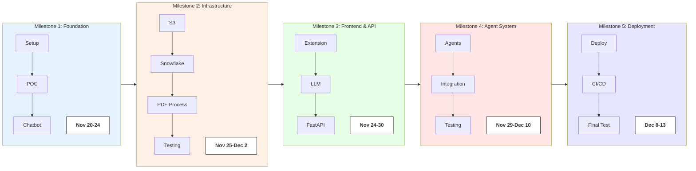
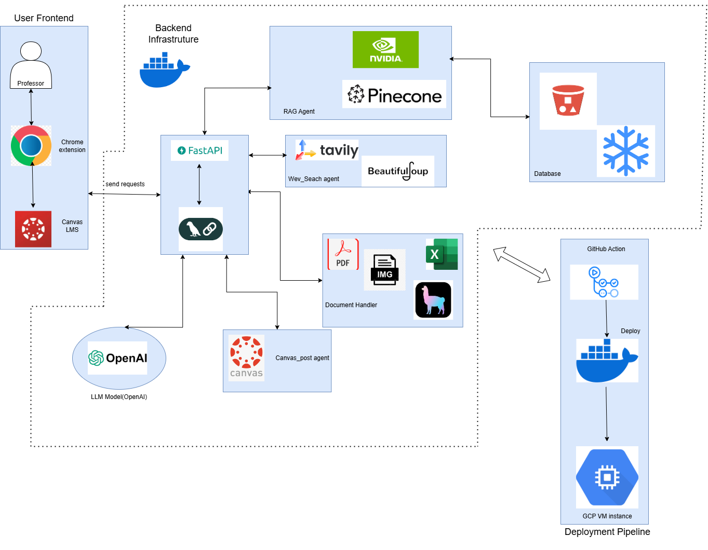
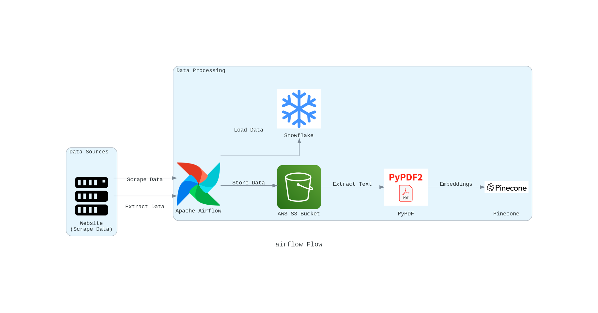

# Final Project

# CanvasGPT: AI Chatbot Agent for Canvas LMS

### Goal of the Project
- Automate routine administrative tasks in Canvas LMS to reduce time burden
- Implement intelligent content organization across course sections
- Creation and management of course announcements
- Enhance content discovery and reusability
- Process and integrate academic materials from research databases
- Improve overall teaching productivity through AI assistance

### Project Overview
CanvasGPT is an innovative AI-powered application designed to transform how professors interact with Canvas Learning Management System (LMS). The system leverages advanced natural language processing to automate course management tasks, process academic materials from SpringerLink Research database, and provide an intuitive chat interface for professors to efficiently manage their courses. Through integrated AI capabilities, secure data management, and automated workflows, CanvasGPT serves as a personal Canvas assistant, enabling educators to focus more on teaching and student engagement rather than administrative tasks.

### Key Technologies Involved

- **Chrome Extension**: Custom UI development for direct Canvas integration and chat interface
- **Streamlit**: Admin dashboard development for monitoring and analytics
- **FastAPI**: High-performance REST API development with async support
- **OpenAI Models**: Natural language processing and document understanding
- **Snowflake DB**: Structured data storage for course and user information
- **Pinecone**: Vector database for semantic search and document retrieval
- **Apache Airflow**: Orchestration of ETL pipelines and scheduling tasks
- **LlamaParser**: Document parsing and text extraction from various formats
- **Docker**: Application containerization and environment standardization
- **Git Actions**: CI/CD pipeline automation and testing
- **GitLab**: Version control and project management
- **Langchain**: Conversation flow management and dialogue state handling
- **NV-Embed Embeddings**: Document vectorization for semantic search
- **HTML/CSS**: Frontend styling and layout
- **JavaScript**: Client-side functionality and Canvas API integration 

### Project Plan and Timeline


## Project Resources

Google codelab(Project Proposal):https://codelabs-preview.appspot.com/?file_id=18N7Q5vqwLqaCPEH7Szblxlza9qDLQ3rpXqKyzLJ1fjE#0
Project Proposal Video: https://www.youtube.com/watch?v=606P_Wa95QE

### Architecture diagram ###





### Deployment
The system is deployed on **Google Cloud Platform (GCP)**, using Docker for containerized deployment:
- **Docker**: Containers manage FastAPI and Streamlit, with Docker Compose orchestrating the components for consistent deployment.
- **GCP**: Ensures public access to the application and scalable infrastructure to accommodate user demand.
- **Git Actions**: When deploying with GitHub Actions, we create workflows in YAML files to automate building, testing, and deploying our code.
- **GitLab**: We plan to leverage GitHub Actions to implement CI/CD pipeline for our project. This setup will automate essential tasks such as deployment, dependency management, and initial testing whenever changes are pushed to the frontend (Chrome extension) or backend (FastAPI) repositories. Additionally, it will facilitate deployments to our GCP instance using Docker, ensuring updated code, rebuilt images. By automating these processes, we aim to maintain system stability, and accelerate feature updates for the CanvasGPT system.


## Pre-Requisite

**Sign Up as Teacher on Canvas**
If you want to create a canvas account for Teacher please follow this:[Sign Up for Canvas LMS as Teacher](https://community.canvaslms.com/t5/Instructor-Guide/How-do-I-sign-up-for-a-new-Free-for-Teacher-Canvas-account-as-an/ta-p/894)


**Generate Token on Canvas LMS API**
Please follow the detail intrction on how can one generate a token on CANVAS LMS: [Generate Token for CANVAS LMS](https://community.canvaslms.com/t5/Canvas-Basics-Guide/How-do-I-manage-API-access-tokens-in-my-user-account/ta-p/615312)

Login here to verify for general canvas infrastructure setup: https://canvas.instructure.com/login/canvas

## Sample Template for Examples:


## GCP DEPLOYMENT

Airflow: Airflow : http://34.162.53.77:8080/

Fastapi : http://34.162.53.77:8000/

Working Video link: https://drive.google.com/file/d/1p2aXtTxx_lKQm0P9EeUD-YhpTGqR-3kD/view?usp=sharing

Google codelab(Final Project): https://codelabs-preview.appspot.com/?file_id=1lvm68fvyLlnEblDbiGVmN_Djr3-gZ8VGf8GeERE3J6I/edit?tab=t.0#0


## Cloud Development Setup

In Final-Project/chrome_extension/popup.js change the localhost endpoint to http://34.162.53.77:8000/agent-workflow
```bash
async function sendMessage() {
        try {
            const message = messageInput.value.trim();
            if (!message && !selectedFile) return;

            // Add user message to chat
            await addMessageToChat('user', message);
            messageInput.value = '';

            let response;

            if (selectedFile) {
                // If there's a file, use FormData
                const formData = new FormData();
                formData.append('message', message);
                formData.append('file', selectedFile);

                response = await fetch('http://34.162.53.77:8000/agent-workflow/form', {
                    method: 'POST',
                    body: formData
                });

                // Clear file selection
                fileNameDisplay.textContent = '';
                selectedFile = null;
            } else {
                // Regular text message - use JSON format
                response = await fetch('http://34.162.53.77:8000//agent-workflow', {
                    method: 'POST',
                    headers: {
                        'Content-Type': 'application/json',
                    },
                    body: JSON.stringify({
                        query: message
                    })
                });
            }
```

## Local Development Setup

1. **Clone the Repository**
```bash
git clone https://github.com/BigData-Fall2024-Team4/Final-Project.git
cd Final-Project
```

2. **Environment Configuration**
```bash
cd backend
cp .env.example .env
```

Update your `.env` file with the following configurations:

```bash
# PostgreSQL Connection Details
OPENAI_API_KEY=''  # Your OPENAI_API_KEY key

# AWS Configuration
AWS_ACCESS_KEY_ID=''          # Your AWS Access Key ID for authentication
AWS_SECRET_ACCESS_KEY=''      # Your AWS Secret Access Key for authentication
S3_BUCKET_NAME=''             # Name of your S3 bucket
S3_BOOKS_FOLDER=''            # Folder path within the S3 bucket for storing books

# Vector Database Configuration
PINECONE_API_KEY=''           # Your Pinecone API Key for authentication
PINECONE_ENVIRONMENT=''       # Your Pinecone environment (e.g., us-west1-gcp)
PINECONE_INDEX_NAME=''        # Name of the Pinecone index to use

# LlamaParse API
LLAMAPARSE_API_KEY=''        # Your LlamaParse API Key for authentication

# Canvas LMS API 
CANVAS_API_KEY=''            # Your Canvas API Key for authentication
CANVAS_BASE_URL=''           # Base URL of your Canvas instance (e.g., https://yourinstitution.instructure.com)

# Note: To obtain CANVAS_API_KEY and configure CANVAS_BASE_URL:
# 1. Log in to your Canvas instance (e.g., your institution's Canvas platform).
# 2. Go to "Account" -> "Settings" in the top-right menu.
# 3. Scroll down to "Approved Integrations" and click "New Access Token."
# 4. Enter a name and expiration date for the token, then click "Generate Token."
# 5. Copy the generated token (this will be your CANVAS_API_KEY) and store it securely.
# 6. Use the base URL of your Canvas instance (e.g., https://yourinstitution.instructure.com) as CANVAS_BASE_URL.

```


3. **Docker Setup**
```bash
# Build and start all services
docker-compose up --build

# To stop services
docker-compose down
```

4. **Chrome Extension Setup**:
   - Open Chrome, go to `chrome://extensions/`, and enable **Developer mode**.
   - Click on **Load unpacked** and select the `chrome_extension` directory from this repository.
   - Once loaded, the extension will be active. Visit a company website to see if the extension displays application information.

## Production Deployment

The system is deployed on AWS with the following components:
- Dockerized FastAPI and Prefect running on GCP instances
- Automated deployments via GitHub Actions

### Deployment Process
1. Push changes to develop branch
2. GitHub Actions automatically:
   - Runs tests
   - Builds Docker images
   - Deploys to GCP
   - Updates containers
   - Performs health checks

### Contributions

| Name                            | Percentage Contribution |
| ------------------------------- | ----------------------- |
| Sarthak Somvanshi               | 33%(Basic chatbot development, Agentic architecture design, Document handler, Canvas Post Agent integration & testing, Final system testing)                    |
| Yuga Kanse                      | 33%(FastAPI endpoint development, Chrome extension LLM integration, Web & Multi-modal agent creation, Testing implementation)                  |
| Tanvi Inchanalkar               | 33%(Data ingestion, Airflow pipeline development (S3, Snowflake, PDF processing), GCP deployment, CI/CD implementation, Documentation & Architecture diagrams)                   |


### Additional Notes
WE ATTEST THAT WE HAVEN’T USED ANY OTHER STUDENTS’ WORK IN OUR ASSIGNMENT AND ABIDE BY THE POLICIES LISTED IN THE STUDENT HANDBOOK. 


